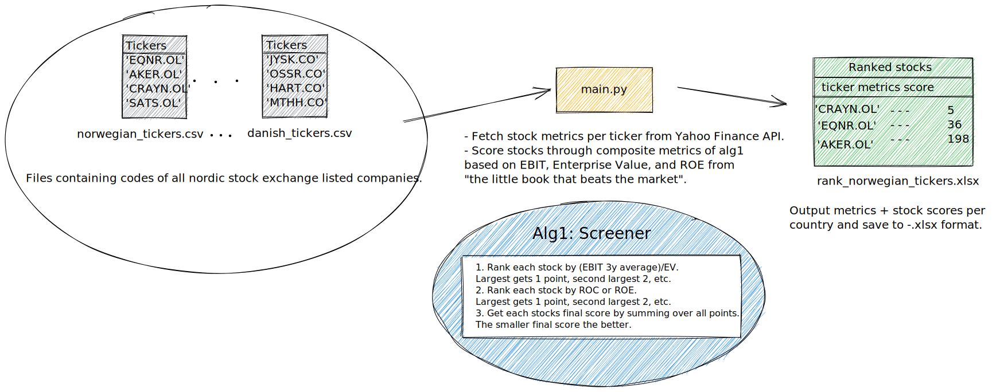

# Nordic Screener


## Description
This repo is a scaled down version of [stock crawler](https://github.com/torjusn/stock_crawler_and_screener) that collects stock metrics through the [`Yahoo Finance API`](https://pypi.org/project/yfinance/) and ranks them based on a set of composite metrics from ["The little book that beats the market"](https://www.amazon.com/Little-Book-Still-Beats-Market/dp/0470624159) by J. Greenblatt. Stock metrics are obtained by referencing ticker codes in yf, e.g. `CRAYN.OL` for `Crayon Group Holding ASA`, and responds with financial- and general info for that stock. Final scores for each stock are saved to excel as `.xlsx`.

## Prerequisites
Install python packages from the requirements-file:
```
pip install -r requirements.txt
```

## Usage
Run mainscript for all tickers and save results to `.xlsx`-file:
```
main.py
```

## References
```
Greenblatt J. The Little Book That Still Beats the Market. 
Hoboken N.J: J. Wiley & Sons; 2010. http://site.ebrary.com/id/10419167. 
Accessed October 1 2022.
```

Special thanks to my colleague Thomas for giving me the opportunity to assist him in his stock adventures.